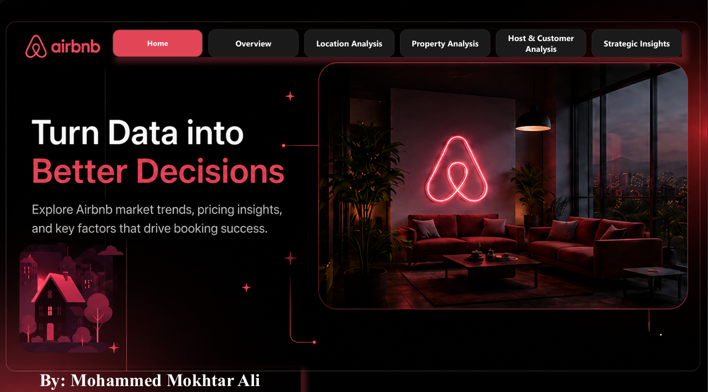
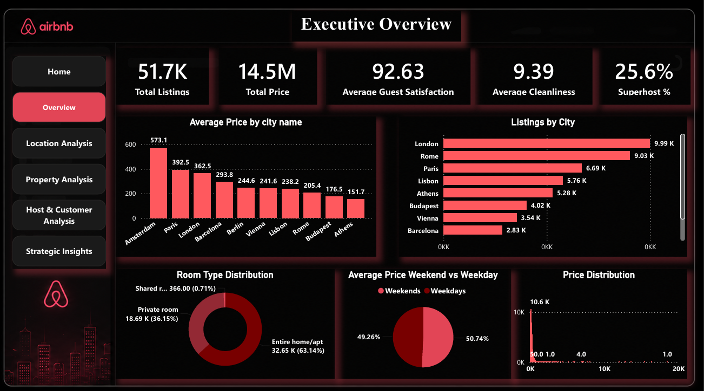
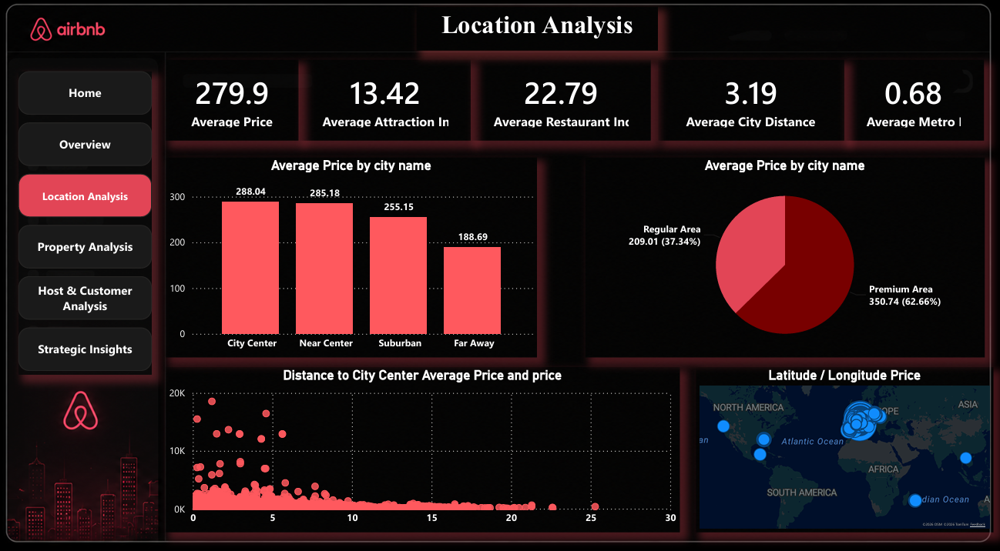
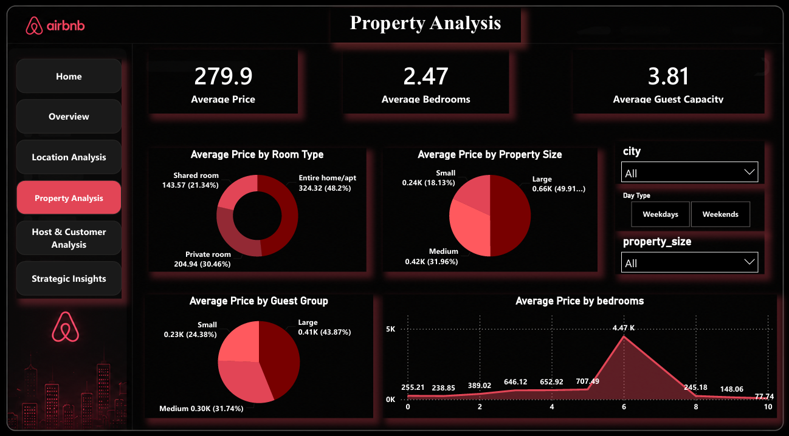
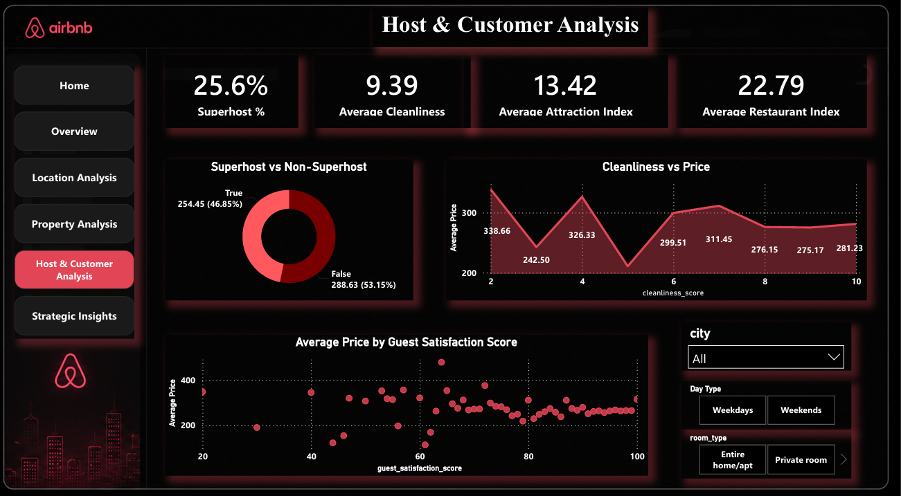
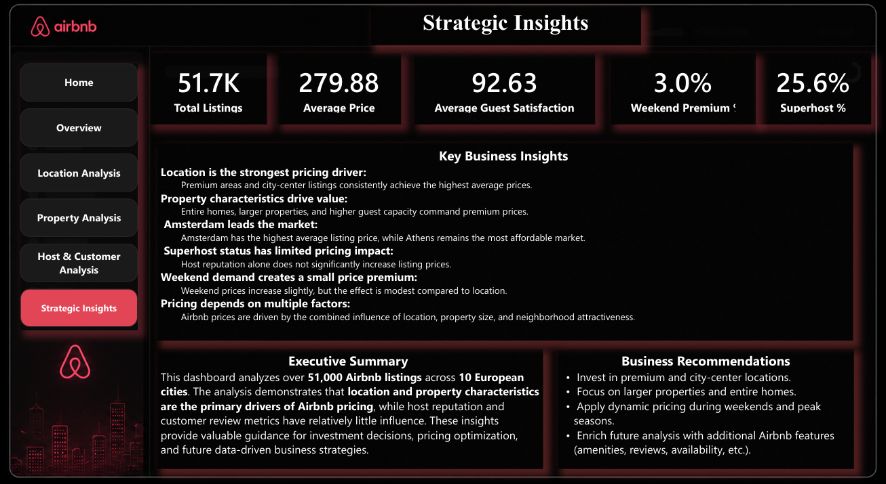

# 🏡 Airbnb Analytics & Business Intelligence Project

## 📌 Project Overview

This project presents an end-to-end Business Intelligence solution for Airbnb listings across major European cities. The goal is to transform raw Airbnb data into actionable business insights through a complete data analytics workflow, including data engineering, exploratory data analysis (EDA), feature engineering, SQL Data Warehouse design, and interactive Power BI dashboards.

The project demonstrates how data can support pricing strategies, investment decisions, and business optimization within the short-term rental market.

---

# 📂 Project Workflow

## 1️⃣ Data Collection

- Raw Airbnb dataset containing 51K+ listings.
- Multiple European cities.
- Property, host, customer, and location information.

---

## 2️⃣ Data Cleaning (Silver Layer)

Performed comprehensive preprocessing including:

- Handling missing values
- Removing duplicate records
- Fixing inconsistent data types
- Standardizing categorical values
- Data validation

---

## 3️⃣ Feature Engineering (Gold Layer)

Created business-oriented features such as:

- Price Category
- Property Size
- Guest Group
- Distance Category
- Premium Location
- Host Type

These features significantly improved business analysis and dashboard storytelling.

---

## 4️⃣ Exploratory Data Analysis (EDA)

Performed extensive analysis to answer business questions including:

- City pricing comparison
- Room type analysis
- Property size analysis
- Guest capacity analysis
- Superhost impact
- Weekend vs Weekday pricing
- Location attractiveness
- Correlation analysis
- Outlier detection
- Business insights generation

---

## 5️⃣ Data Warehouse Design

Designed a Star Schema in SQL Server.

### Fact Table

- Fact_Listings

### Dimension Tables

- Dim_City
- Dim_Room
- Dim_Host

This structure improves scalability and reporting performance.

---

## 6️⃣ Power BI Dashboard

Developed a multi-page interactive dashboard.

### Pages

- Executive Overview
- Location Analysis
- Property Analysis
- Host & Customer Analysis
- Executive Summary

Interactive filters allow users to explore:

- City
- Room Type
- Property Size
- Day Type
- Premium Location

---

# 📊 Key Business Insights

- Location is the strongest pricing driver.
- Amsterdam has the highest average listing prices.
- Entire homes command premium prices.
- Larger properties generate higher revenue.
- Premium neighborhoods significantly increase listing value.
- Weekend prices are slightly higher.
- Superhost status has limited impact on pricing.
- Guest ratings and cleanliness have little influence on price.

---

# 💼 Business Recommendations

- Invest in premium locations.
- Focus on larger properties.
- Prioritize entire-home listings.
- Apply dynamic weekend pricing.
- Expand future data collection with additional Airbnb attributes.

---

# 🛠️ Technologies Used

- Python
- Pandas
- NumPy
- Plotly
- SQL Server
- SQLAlchemy
- Power BI
- DAX
- Git
- GitHub

---

# 📁 Project Structure

```
Airbnb_Project/
│
├── Bronze/
├── Silver/
├── Gold/
├── EDA/
├── Datasets/
├── dashboard/
├── Presentation/
└── README.md
```

---

# 🚀 Dashboard Preview

## 1. Home



## 2. Executive Overview



## 3. Location Analysis



## 4. Property Analysis



## 5. Host & Customer Analysis



## 6. Executive Summary




